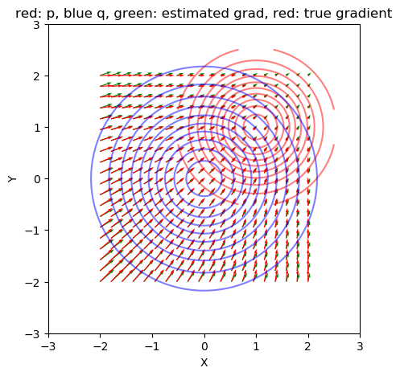

# Variational Gradient Descent using Local Linear Models
[Song Liu](http://allmodelsarewrong.net), Jack Simons, Mingxuan Yi, Mark Beaumont 

https://arxiv.org/abs/2305.15577

## Folder Structure
- ```/misc``` where some toy examples are provided. 
  - run ```demo_illus.py```
  - 
- ```code/```: the code to reproduce our experiments. 
  - Our code requires ```pytorch```, ```sbibm```, MATLAB and its python engine (```python -m pip install matlabengine```)
  - to see SVGD with and without normalization, open matlab and run ```demo_svgd.m```
  - to reproduce two-moons results, run python ```demo_twomoons.py```
    - after this, open matlab and run ```plottwomoons.m``` to see particles being transported in posterior space. 
  - to reproduce CelebA results, run
    - ```python makedata.py```
    - ```python demo_smile.py``` 

- ```videos/``` Visualization of experiment results. You can also see visualization of our experiments on YouTube. 
    - [](https://youtu.be/JOkWak1ewDE)
    - [](https://youtu.be/9YdEr2HqHMw)

  